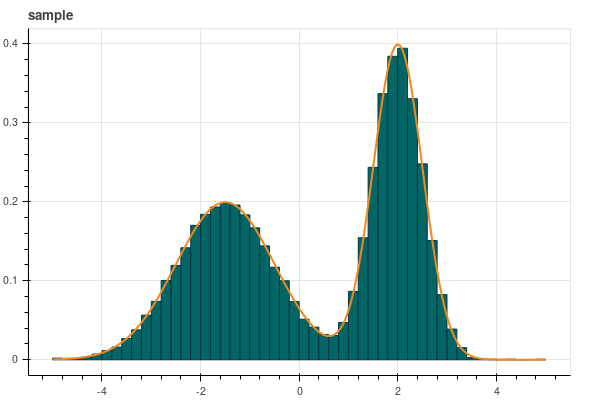

Inverse CDF
===========

This package computes the inverse cumulative distribution function (iCDF) from a
given probability density function (PDF). This is useful if you want to sample
floating points from this PDF, by mapping a uniformly distributed sample to the
target distribution.

Other than that, this project serves as an example of how to link C++ code with
Python, using Cython and a proper `setup.py`. This example contains a single
function with a callback to Python functions from C and a Numpy array
as argument to the C function.

See the notebook for an example.

